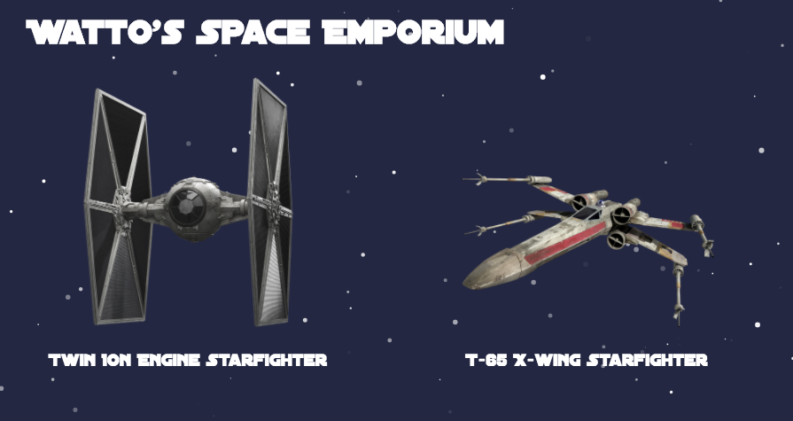

# Watto's Space Emporium Site

This is a demo site for Watto's Space Emporium.

## Installation

Installing this site requires that you have [`git`](https://git-scm.com/book/en/v2/Getting-Started-Installing-Git) and [`node`/`npm`](https://docs.npmjs.com/getting-started/installing-node) installed.

To install this site, and run it locally, follow these steps:

1) Clone the repo: `git clone https://github.com/localjo/wattos.git && cd wattos`
2) Install dependencies: `npm install`
3) Start the site: `npm start`
